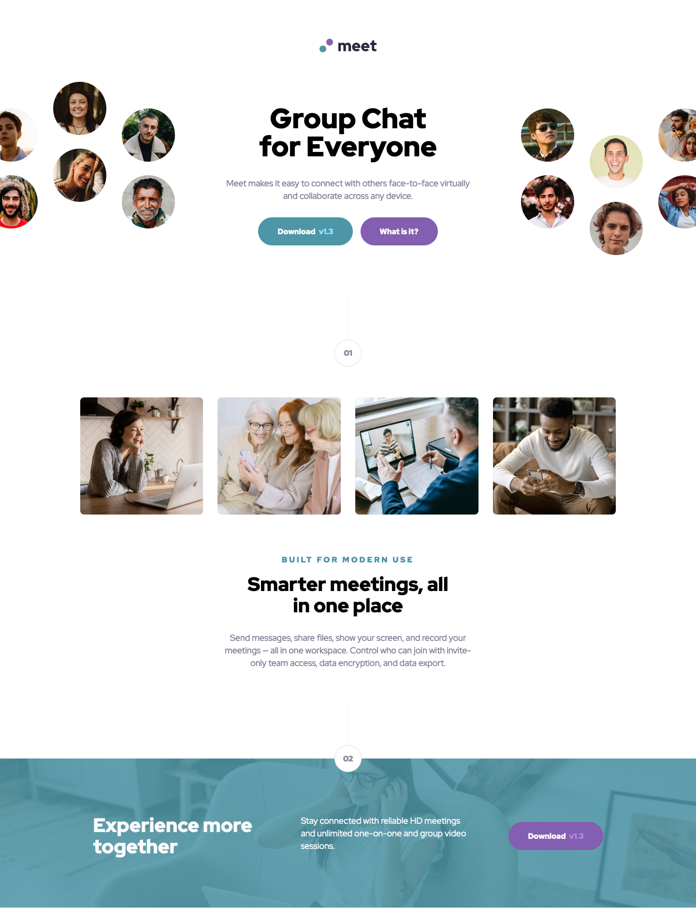

# Frontend Mentor - Meet landing page solution

This is a solution to the [Meet landing page challenge on Frontend Mentor](https://www.frontendmentor.io/challenges/meet-landing-page-rbTDS6OUR). Frontend Mentor challenges help you improve your coding skills by building realistic projects.

## Table of contents

- [Overview](#overview)
  - [The challenge](#the-challenge)
  - [Screenshot](#screenshot)
  - [Links](#links)
- [My process](#my-process)
  - [Built with](#built-with)
  - [What I learned](#what-i-learned)
- [Author](#author)
- [Acknowledgments](#acknowledgments)

## Overview

### The challenge

Users should be able to:

- View the optimal layout depending on their device's screen size
- See hover states for interactive elements

### Screenshot




### Links

- Solution URL: [Add solution URL here](https://your-solution-url.com)
- Live Site URL: [Live Site](https://nifty-pasteur-c33e5a.netlify.app)

## My process

### Built with

- Semantic HTML5 markup
- BEM Methodology
- SCSS
- Flexbox
- CSS Grid
- Desktop-first workflow
- [Parcel](https://parceljs.org/) - Bundler

### What I learned

I learned how to apply a color over an image using background-image with a gradient over it. I did try another way (Option 2) as a first attempt, and I decided to go with option 1 as it was the simplest of the two.

# Option:1

```css
background-image: linear-gradient(
    rgba(clr.$color-primary-500, 0.85),
    rgba(clr.$color-primary-500, 0.85)
  ), url(../assets/desktop/image-footer.jpg);
background-repeat: no-repeat;
background-size: cover;
```

# Option:2

This option required adding a pseudo element to img element. Then I had to change the z-index pseudo element to make sure it sits on top of the image.

```css
// &::before {
//   content: "";
//   background-image: url(../assets/desktop/image-footer.jpg);
//   background-size: cover;
//   width: 100%;
//   height: 100%;
//   position: absolute;
//   top: 0;
//   left: 0;
//   opacity: 0.145;
// }
```

## Author

- Website - [](www.sergiorswork.com)
- Frontend Mentor - [@sergioreynoso](https://www.frontendmentor.io/profile/sergioreynoso)
- LinkedIn - [@sreynoso](https://www.linkedin.com/in/sreynoso/)

## Acknowledgments

I would like to thank [Jonas Schmedtmann](https://codingheroes.io) for all his great [Demy courses](https://www.udemy.com/user/jonasschmedtmann/), as well as [Kevin Powell](https://www.kevinpowell.co) for all the great css content.
